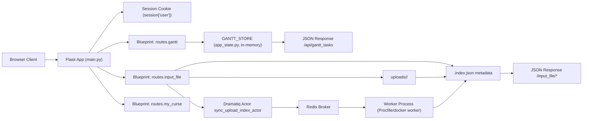
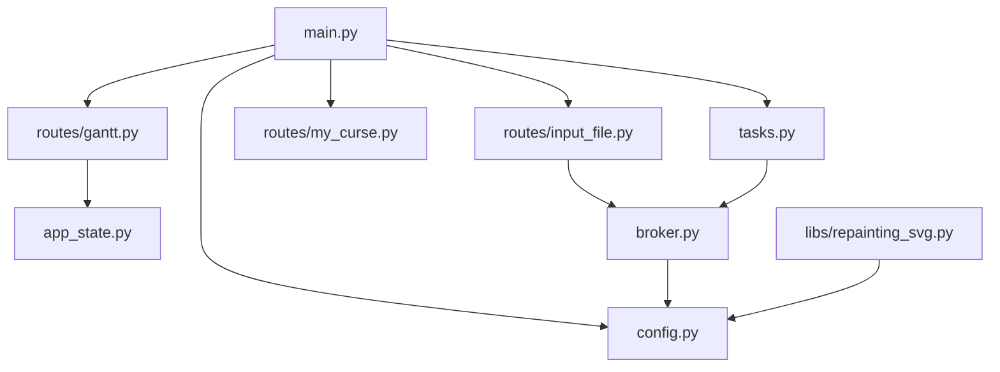

# MOSPOLI_LMS

**Generated:** 2026-02-21  
**Commit:** cca01c7  
**Branch:** main

## OVERVIEW

MOSPOLI_LMS — Flask-приложение для LMS-сценариев с серверным рендерингом страниц (`templates/*`) и статикой (`static/*`).

Текущий runtime-подход:
- HTTP-слой: `main.py` + blueprints `routes/gantt.py`, `routes/my_curse.py`, `routes/input_file.py`.
- Состояние: смешанное (`session`, in-memory `GANTT_STORE`, файловое хранилище `uploads/*` + `.index.json`).
- Фоновые задачи: `dramatiq` + Redis broker (`broker.py`), используется для пересинхронизации индекса загрузок.
- Логирование: `loguru`, инициализация через `config.py`/`config.json`.
- Прод-контур: `gunicorn` (web) + `dramatiq worker` (worker), см. `Procfile` и `docker-compose.yml`.

## STRUCTURE

```text
MOSPOLI_LMS/
+-- main.py                         # Flask entry-point, регистрация blueprints, базовые страницы
+-- routes/
|   +-- gantt.py                    # Gantt UI + CRUD API задач (in-memory)
|   +-- input_file.py               # Файлы: list/upload/rename/delete/preview/download
|   +-- my_curse.py                 # Страница "мой курс"
|   +-- input_file/__pycache__/     # Служебная папка
|   +-- __init__.py                 # Пакет роутов
+-- app_state.py                    # GANTT_STORE (in-memory shared state)
+-- broker.py                       # Dramatiq RedisBroker bootstrap
+-- tasks.py                        # Пример actor (`broker_init_check`)
+-- config.py                       # Загрузка config.json + настройка loguru
+-- config.json                     # runtime-конфиг (redis_url, logging, site version)
+-- templates/                      # Jinja2 templates
+-- static/                         # CSS/JS/fonts/icons/media
+-- libs/repainting_svg.py          # SVG repaint utility (сейчас не подключен в main)
+-- docker/
|   +-- Dockerfile.app              # Образ web-приложения
|   +-- Dockerfile.worker           # Образ dramatiq worker
|   +-- file_storage/               # Nginx readonly-хранилище для uploads
+-- docker-compose.yml              # Postgres + Redis + app + worker + file_storage
+-- Procfile                        # Процессы web/worker для PaaS
+-- requirements.txt                # Python dependencies
+-- pyproject.toml                  # ruff/mypy/pylint + poe tasks
+-- .github/workflows/              # CI: quality checks + docker build
+-- AGENTS.md                       # Этот документ
```

## WHERE TO LOOK

| Task | File/Folder | Note |
|---|---|---|
| Точка входа и регистрация модулей | `main.py` | Создание Flask app, SocketIO, blueprints, базовые маршруты |
| Gantt API и страница | `routes/gantt.py` | `GET /gantt*`, `GET/POST/PUT/DELETE /api/gantt_tasks*` |
| In-memory state Gantt | `app_state.py` | `GANTT_STORE` общий для `routes/gantt.py` |
| Файловый блок (backend) | `routes/input_file.py` | Валидация, индекс `.index.json`, upload/rename/delete |
| Фоновые задачи upload-индекса | `routes/input_file.py`, `broker.py`, `tasks.py` | Actor `sync_upload_index_actor`, Redis broker |
| Конфиги и логирование | `config.py`, `config.json` | `configure_logger()`, `load_app_config()` |
| HTML-шаблоны | `templates/` | Страницы LMS и error views |
| Клиентская логика file block | `static/input_file/input_file.js` | Основной JS для блока загрузок |
| CI quality gate | `.github/workflows/pr-checks.yml` | Ruff/Mypy/Pylint + compile/import smoke |
| Docker окружение | `docker-compose.yml`, `docker/*` | Локальный infra-контур + образы app/worker/storage |

## CONVENTIONS

- Аутентификация в UI-роутах основана на `session["user"]`; неавторизованные пользователи редиректятся на `/login`.
- Ошибки в роутерах логируются через UUID (`uuid4`) и в большинстве случаев отдаются через `templates/error/error.html`.
- Для upload-роутов обязательна связка: `_require_request_config()` -> `_require_upload_context()`.
- Имя файла валидируется через `_is_safe_filename()` (без `..`, `/`, `\\`, traversal).
- Индекс загрузок хранится как JSON (`.index.json`) и пишется атомарно через `temp` + `os.replace`.
- Метаданные файла (`size`, `mtime`, `hash`, `ext`, `is_image`) формируются через `_build_file_record()`.
- Пересчёт hash после изменений запускается асинхронно через `sync_upload_index_actor`.
- Gantt-данные хранятся в памяти процесса (`GANTT_STORE`) и теряются при рестарте.
- Логгер и конфиг поднимаются централизованно через `configure_logger()`/`load_app_config()`.

## ANTI-PATTERNS

| Pattern | Why Bad Here | Preferred Alternative |
|---|---|---|
| Добавлять новую доменную логику в `main.py` по умолчанию | `main.py` уже большой и смешивает несколько зон ответственности | Выносить новые домены в отдельный blueprint в `routes/` |
| Писать в `uploads` напрямую из новых функций | Легко обойти валидации имени/контекста/лимитов | Переиспользовать `_require_upload_context`, `_is_safe_filename`, `_save_index` |
| Полагаться на `users = {"admin": ...}` для production-auth | Это демо-словарь в памяти | Подключать внешнюю auth-модель/БД при расширении |
| Использовать `GANTT_STORE` для долговременных данных | Данные сбрасываются при рестарте процесса | Персистентное хранилище (БД) |
| Дублировать настройки логгера в модулях | Может привести к дублям sink/неодинаковым настройкам | Вызывать `configure_logger()` и читать `config.json` |

## UNIQUE PATTERNS

1. `routes/input_file.py` импортирует broker через side-effect (`from broker import broker as _dramatiq_broker`) для гарантированной регистрации Dramatiq broker.
2. Upload-индекс обновляется в 2 этапа: быстрый sync без hash на запросе + фоновый пересчёт hash actor'ом.
3. В `main.py` есть startup-подготовка Gantt-статики: удаление BOM и замена внешних Google Fonts URL на локальные файлы `static/gantt/fonts`.
4. Объявления роутов в `main.py` находятся внутри `try`, а fallback `catch_all` создаётся в `except`-ветке при ошибке инициализации.

## COMMANDS

```bash
# Local run
python main.py

# Quality (из CI)
ruff format --check .
ruff check .
mypy .
pylint --rcfile=.pylintrc --recursive=y .
python -m compileall -q main.py config.py app_state.py broker.py tasks.py routes libs

# Poe tasks (если установлен poethepoet)
poe check

# Procfile-equivalent
gunicorn --worker-class gthread --threads ${GUNICORN_THREADS:-8} -w ${WEB_CONCURRENCY:-2} --bind 0.0.0.0:${PORT:-5000} main:app
dramatiq tasks routes.input_file --processes ${DRAMATIQ_PROCESSES:-2} --threads ${DRAMATIQ_THREADS:-4}

# Docker stack
docker compose up --build
```

## NOTES

- В `docker-compose.yml` присутствуют `postgres` и `DATABASE_URL`, но в текущем runtime-коде SQLAlchemy/ORM не используется.
- `SocketIO` инициализируется в `main.py` (`async_mode="threading"`), но event-handlers в репозитории не объявлены.
- `fetch_input_file_config_from_db()` сейчас возвращает конфиг только для `uuid_for_upload="test"`; остальные UUID вернут not found.
- В `main.py` есть hardcoded demo-данные (`users`, `courses_data`, `user_profile`, seed tasks для Gantt).
- `GET /logout` рендерит `logout.html`, но файл `templates/logout.html` отсутствует.
- `docker/file_storage` публикует readonly-доступ к `uploads` через Nginx basic auth.

## Large Files

| File | Lines | Reason to Refactor |
|---|---:|---|
| `routes/input_file.py` | 686 | Смешаны config loading, validation, index I/O, API handlers, actor wiring |
| `static/input_file/input_file.js` | 686 | Большой монолит клиентской логики file-block |
| `static/input_file/input_file.css` | 667 | Крупный единый stylesheet, мало модульности |
| `main.py` | 383 | Много разнотипных маршрутов и startup-логики в одном файле |
| `templates/gantt/gantt_dhtmlx.html` | 365 | Объёмный template со скриптами/markup для Gantt |
| `routes/gantt.py` | 303 | В одном модуле и UI endpoint, и API CRUD, и static-serving |

## MEMORY GRAPH

### Runtime Data/Memory Flow



### Memory Ownership Stages

| Stage | Primary owner | Representation | Key note |
|---|---|---|---|
| Auth state | Flask session | `session['user']`, `session['theme']`, `session['checked_files']` | Cookie-backed session state |
| Gantt runtime state | `app_state.GANTT_STORE` | `dict[id -> {data, links}]` | Process memory only, reset on restart |
| Upload filesystem state | `routes/input_file.py` | Files in `uploads/<course>/<user>/` | Persistent on disk/volume |
| Upload metadata state | `.index.json` | JSON map of files + meta/hash | Atomic writes via temp file + replace |
| Async reindex queue | Dramatiq + Redis | Actor messages (`queue_name="input_file"`) | Worker consumes and recalculates hash |

### Module Dependency Graph


