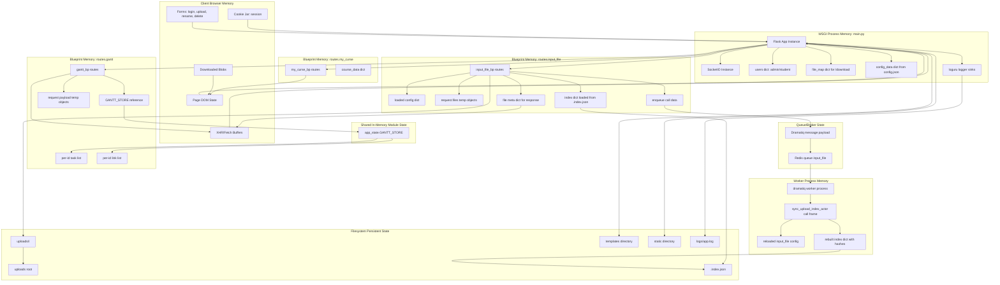
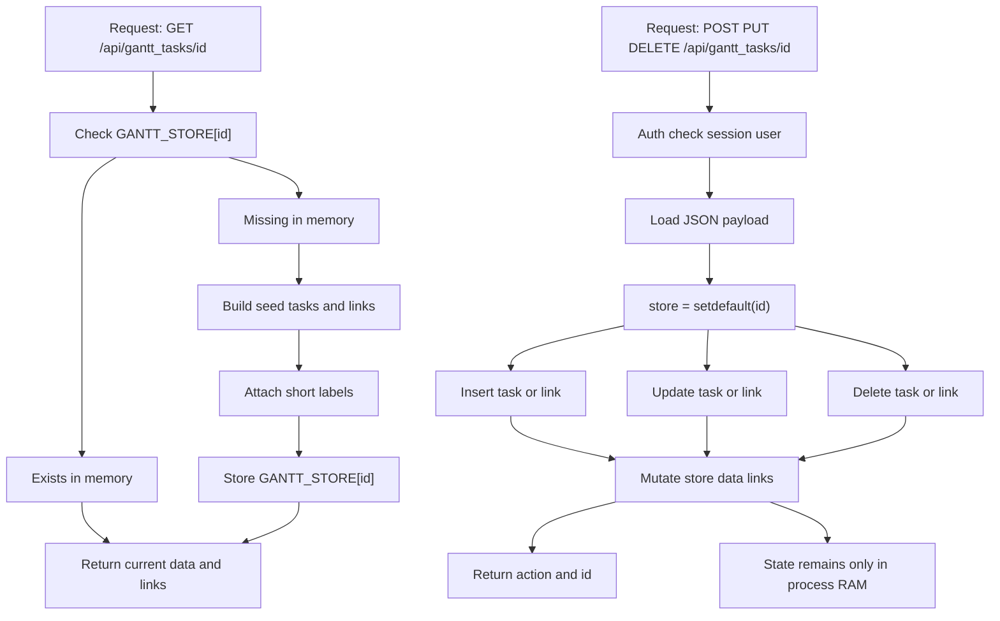
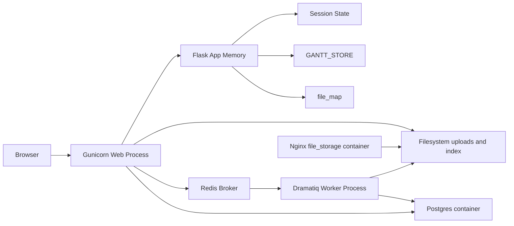
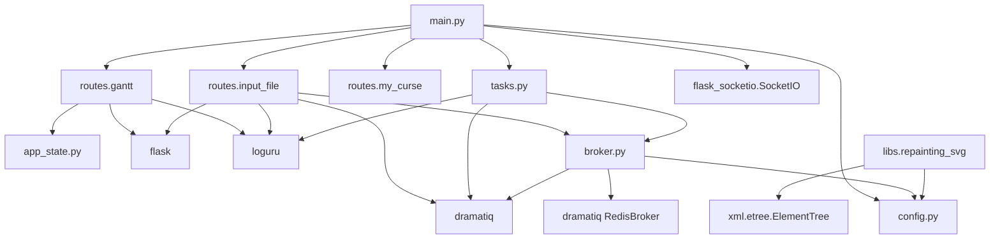

Ключевые характеристики:
- HTTP/UI: `main.py` + `routes/*`.
- Шаблоны: `templates/*`.
- Статика: `static/*`.
- Состояние: `session` + in-memory `GANTT_STORE` + файловая система `uploads/*`.
- Фоновые задачи: `dramatiq` actor в `routes/input_file.py`, broker в `broker.py`.
- Логирование: `loguru` через `configure_logger()` из `config.py`.

## 2. Стек и инфраструктура

- Python 3.13 (по CI и Dockerfile)
- Flask 3.1.2
- Flask-SocketIO 5.6.0
- Dramatiq 1.17.1
- Redis 5/8.x (зависит от окружения)
- Gunicorn (web process)
- Docker Compose: `postgres`, `redis`, `app`, `dramatiq_worker`, `file_storage`

Важно про БД:
- В `docker-compose.yml` есть `postgres` и `DATABASE_URL`.
- В текущем runtime-коде SQLAlchemy/ORM не используется.

## 3. Быстрый старт

### 3.1 Без Docker: один PowerShell-скрипт

```powershell
.\scripts\start_native.ps1
```

Скрипт сам:

- создаёт `.venv` через `uv`;
- ставит `requirements.txt` и `requirements-semantic.txt`;
- скачивает portable Qdrant для Windows;
- запускает Qdrant на `localhost:6333`;
- запускает Infinity на `localhost:7997`;
- скачивает и поднимает модели:
  - `jinaai/jina-embeddings-v5-text-small`;
  - `jinaai/jina-reranker-v3`;
- индексирует `data/semantic_routes.json` в Qdrant;
- запускает сайт на `http://127.0.0.1:5000`.

Остановка всего native-контура:

```powershell
.\scripts\stop_native.ps1
```

Первый запуск может быть долгим: модели скачиваются из Hugging Face и кешируются локально.

### 3.2 Через Docker Compose: один compose

```bash
docker compose up --build
```

Сервисы:
- `app`: Flask + gunicorn
- `dramatiq_worker`: обработка фоновых задач
- `redis`: брокер очереди
- `postgres`: подготовлен, но в runtime почти не задействован
- `file_storage`: readonly nginx-обёртка над `uploads` с basic auth
- `qdrant`: vector store для Semantic Router
- `infinity`: embedding/rerank server с Jina-моделями
- `semantic_indexer`: one-shot индексация маршрутов после готовности Qdrant/Infinity

Сайт будет доступен на `http://127.0.0.1:5000`.

### 3.3 Проверка Semantic Router

После запуска войдите как `student / 123` или `admin / admin`.

Пример API-проверки:

```powershell
uv run python -m semantic_router.cli check
```

Ожидаемый результат: Qdrant collection `routes` в статусе `green`, `points_count` равен количеству маршрутов в `data/semantic_routes.json`.

## 4. Структура проекта

```text
MOSPOLI_LMS/
+-- main.py
+-- app_state.py
+-- config.py
+-- config.json
+-- broker.py
+-- tasks.py
+-- routes/
|   +-- gantt.py
|   +-- input_file.py
|   +-- my_curse.py
|   +-- __init__.py
+-- templates/
+-- static/
+-- libs/
|   +-- repainting_svg.py
+-- docker/
|   +-- Dockerfile.app
|   +-- Dockerfile.worker
|   +-- file_storage/
+-- docker-compose.yml
+-- Procfile
+-- pyproject.toml
+-- requirements.txt
+-- requirements-semantic.txt
+-- scripts/
|   +-- start_native.ps1
|   +-- stop_native.ps1
|   +-- wait_for_semantic_services.py
+-- AGENTS.md
```

## 5. Основные роуты

### 5.1 `main.py`

- `GET /favicon.ico`
- `GET /execution-status`
- `GET /`
- `GET|POST /comments/<entity_id>`
- `GET /base`
- `GET /blockvideo`
- `GET /filesblock`
- `POST /filesblock/toggle`
- `GET /dashboard`
- `GET|POST /logout`
- `GET|POST /settings`
- `GET /courses`
- `GET|POST /ui-ui-a`
- `GET|POST /login`
- `GET /download/<fid>`
- `GET /<path:path>` fallback

### 5.2 `routes/gantt.py`

- `GET /gantt/<id>`
- `GET /gantt`
- `GET /api/gantt_tasks`
- `GET /api/gantt_tasks/<id>`
- `POST|PUT|DELETE /api/gantt_tasks/<id>`
- `GET /gantt/static/<filename>`

### 5.3 `routes/input_file.py`

- `GET /input_file`
- `GET /input_file/<ID_fields>`
- `GET /input_file/<uuid_for_upload>/list`
- `POST /input_file/<uuid_for_upload>/upload`
- `POST /input_file/<uuid_for_upload>/rename`
- `POST /input_file/<uuid_for_upload>/delete`
- `GET /input_file/file/<uuid_for_upload>/<filename>`
- `GET /input_file/download/<uuid_for_upload>/<filename>`

### 5.4 `routes/my_curse.py`

- `GET /my_curse/<id>`

## 6. Где смотреть по задачам

| Задача | Куда смотреть | Комментарий |
|---|---|---|
| Регистрация модулей и app bootstrap | `main.py` | Flask app, SocketIO, blueprints, секреты, startup логика |
| Gantt API и хранение | `routes/gantt.py`, `app_state.py` | Данные живут в `GANTT_STORE` в памяти процесса |
| Файловый блок | `routes/input_file.py` | Валидация, upload lifecycle, `.index.json`, actor enqueue |
| Очереди/брокер | `broker.py`, `tasks.py` | RedisBroker и dramatiq actor wiring |
| Логирование | `config.py`, `config.json` | Единая конфигурация loguru |
| CI quality gate | `.github/workflows/pr-checks.yml` | Ruff + Mypy + Pylint + compile/import smoke |
| Прод процессы | `Procfile` | `web` и `worker` процессы |
| Контейнерная разработка | `docker-compose.yml`, `docker/*` | Полный локальный контур окружения |

## 7. MEMORY GRAPH (Super Detailed)

Ниже не один «красивый» граф, а рабочая карта памяти/данных для разработки и отладки.

### 7.1 Full Runtime Memory Map (Web + Worker + FS + Session)



### 7.2 Upload Subsystem Memory Lifecycle (Synchronous + Asynchronous)

```mermaid
flowchart LR
    U1["HTTP Request: upload/list/rename/delete"] --> U2["_require_request_config"]
    U2 --> U3["load_input_file_config(uuid)"]
    U3 --> U4["config dict in memory"]

    U4 --> U5["_require_upload_context"]
    U5 --> U6["session user validation"]
    U5 --> U7["course_id validation regex"]
    U5 --> U8["resolved upload_dir and upload_index"]

    U8 --> U9["_load_index from .index.json"]
    U9 --> U10["index dict in RAM"]

    U10 --> U11["upload branch"]
    U10 --> U12["rename branch"]
    U10 --> U13["delete branch"]
    U10 --> U14["list branch"]

    U11 --> U15["validate filename and ext"]
    U15 --> U16["save file to disk"]
    U16 --> U17["build_file_record without hash"]
    U17 --> U18["save index atomically"]

    U12 --> U19["os.replace old to new"]
    U19 --> U20["rebuild record and save index"]

    U13 --> U21["os.remove file"]
    U21 --> U22["remove entry and save index"]

    U14 --> U23["sync index without hash"]
    U23 --> U24["build_file_meta list"]
    U24 --> U25["json response"]

    U18 --> U26["enqueue sync_upload_index_actor"]
    U20 --> U26
    U22 --> U26

    U26 --> U27["dramatiq message to redis"]
    U27 --> U28["worker receives message"]
    U28 --> U29["_sync_upload_index with hash"]
    U29 --> U30["sha256 hash chunks"]
    U30 --> U31["write refreshed .index.json"]
```



### 7.3 Gantt In-Memory State Machine (per `id`)



### 7.4 Process Topology and Memory Boundaries



### 7.5 Memory Ownership Stages (Detailed)

| Stage | Owner | Representation | Lifetime | Write Path | Read Path | Risk |
|---|---|---|---|---|---|---|
| Login session | Flask app + client cookie | `session["user"]` | До logout/смены secret | `/login`, `/logout` | Почти все защищённые роуты | Потеря сессии при смене `SECRET_KEY` |
| Theme toggle | Flask session | `session["theme"]` | Пока жива сессия | `/settings` | `/settings` template logic | Неперсистентно для разных устройств |
| Checked files UI | Flask session | `session["checked_files"]` | Пока жива сессия | `/filesblock/toggle` | `/filesblock` | Сессионная, не общая между пользователями |
| Gantt data | Python process | `GANTT_STORE[id]` | До рестарта web process | `/api/gantt_tasks/<id>` mutate | `/api/gantt_tasks/<id>` get | Сброс при рестарте, нет межпроцессной синхронизации |
| Temporary file upload objects | Flask request context | `request.files` | Один HTTP request | `/input_file/<uuid>/upload` | Внутри upload handler | Рост RAM при крупных загрузках |
| Upload directory state | Filesystem | `uploads/<course>/<user>` | Долговременно | Upload/rename/delete handlers | list/get/download handlers | Требует строгой валидации имён |
| Upload metadata index | Filesystem JSON | `.index.json` | Долговременно | `_save_index()` | `_load_index()`, list responses | Расхождение при ручных изменениях файлов |
| Hash calculation buffers | Web/worker process | chunked bytes | Во время пересчёта hash | `_compute_file_hash()` | Используется в `_build_file_record()` | CPU/IO нагрузка на больших файлах |
| Queue message | Redis | dramatiq message | До обработки worker | `_enqueue_index_sync()` | worker actor dispatcher | Задержка или потеря при недоступном Redis |
| Worker index state | Worker process RAM | index dict + config | Один actor execution | `sync_upload_index_actor` | same actor | Невалидный `uuid_for_upload` => no-op |
| Log events | loguru sinks + file | `logs/app.log` | По retention | `logger.*` | Ops/diagnostics | Рост логов без ротации (настроена в config) |

### 7.6 Module Dependency Graph (Detailed)



## 8. Конвенции разработки

- Для новых backend-доменов предпочтителен отдельный blueprint в `routes/`.
- Для upload-функций использовать существующие guards и helpers (`_require_upload_context`, `_is_safe_filename`, `_save_index`).
- Не опираться на `GANTT_STORE` как на персистентное хранилище.
- Не дублировать настройку логгера вручную; использовать `configure_logger()`.
- Для диагностируемых ошибок сохранять UUID в лог и показывать пользователю error page с `id_error`.

## 9. Ограничения текущей реализации

- `users` в `main.py` — demo auth в памяти.
- `fetch_input_file_config_from_db()` сейчас возвращает конфиг только для `uuid_for_upload="test"`.
- `GET /logout` рендерит `logout.html`, но шаблон отсутствует.
- `SocketIO` инициализирован, но socket event handlers не объявлены.
- В коде есть зависимости для SQL, но активной ORM-модели нет.

## 10. Команды качества

```bash
ruff format --check .
ruff check .
mypy .
pylint --rcfile=.pylintrc --recursive=y .
py -3 -m compileall -q main.py config.py app_state.py broker.py tasks.py routes libs
```

## 11. Large Files (кандидаты на декомпозицию)

| File | Lines | Почему декомпозировать |
|---|---:|---|
| `routes/input_file.py` | 686 | Смешаны API, валидация, индекс, actor orchestration |
| `static/input_file/input_file.js` | 686 | Крупный JS-монолит client-side поведения |
| `static/input_file/input_file.css` | 667 | Большой единый стиль без модульных слоёв |
| `main.py` | 383 | Много route-логики и startup-подготовки в одном файле |
| `templates/gantt/gantt_dhtmlx.html` | 365 | Большой шаблон с насыщенной клиентской логикой |
| `routes/gantt.py` | 303 | UI endpoint, API CRUD и static-serving в одном модуле |
